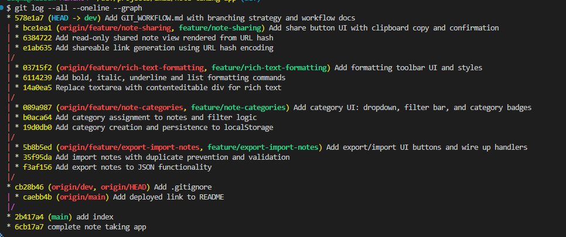

# Git Workflow Documentation

This document explains the branching strategy, commit conventions, conflict resolution, and git commands used throughout the development of this note-taking app.

---

## Table of Contents

1. [Branching Strategy](#branching-strategy)
2. [Commit Message Conventions](#commit-message-conventions)
3. [Merge Conflict: Encountered and Resolved](#merge-conflict-encountered-and-resolved)
4. [Git Commands Reference](#git-commands-reference)
5. [Screenshots](#screenshots)

---

## Branching Strategy

This project uses a **trunk-based, feature-branch workflow** with three levels of branches:

```
main
 └── dev
      ├── feature/export-import-notes
      ├── feature/note-categories
      ├── feature/rich-text-formatting
      └── feature/note-sharing
```

### Branch Roles

| Branch | Purpose |
|--------|---------|
| `main` | Production-ready code. Only receives merges from `dev` after all features are stable. |
| `dev`  | Integration branch. All feature PRs target `dev`. Acts as a staging area before `main`. |
| `feature/*` | Short-lived branches for individual features. Created from `dev`, merged back into `dev` via Pull Request. |

### Why This Structure?

- `main` is always deployable — no half-finished features ever land there directly.
- `dev` acts as a buffer, letting multiple features integrate and be tested together before promotion.
- Feature branches isolate work so developers can work in parallel without breaking each other.

### Branch Naming Convention

All feature branches use the prefix `feature/` followed by a short, hyphenated description of the feature:

```
feature/export-import-notes
feature/note-categories
feature/rich-text-formatting
feature/note-sharing
```

> **Note:** The original plan used `ft/` as the prefix. During execution the convention was updated to `feature/` for clarity and consistency with common open-source norms.

---

## Commit Message Conventions

All commits in this project follow the **imperative mood** convention: the message reads as a command describing what the commit *does*, not what was *done*.

### Format

```
<verb> <what was changed>
```

No scope, type prefix, or ticket number is required at this scale. Each commit covers one logical unit of work.

### Examples from This Project

| Hash | Message |
|------|---------|
| `6cb17a7` | `complete note taking app` |
| `cb28b46` | `Add .gitignore` |
| `f3af156` | `Add export notes to JSON functionality` |
| `35f95da` | `Add import notes with duplicate prevention and validation` |
| `5b8b5ed` | `Add export/import UI buttons and wire up handlers` |
| `19d0db0` | `Add category creation and persistence to localStorage` |
| `b0aca64` | `Add category assignment to notes and filter logic` |
| `089a987` | `Add category UI: dropdown, filter bar, and category badges` |
| `14a0ea5` | `Replace textarea with contenteditable div for rich text` |
| `6114239` | `Add bold, italic, underline and list formatting commands` |
| `03715f2` | `Add formatting toolbar UI and styles` |
| `e1ab635` | `Add shareable link generation using URL hash encoding` |
| `6384722` | `Add read-only shared note view rendered from URL hash` |
| `bce1ea1` | `Add share button UI with clipboard copy and confirmation` |

### Rules Observed

- **One concern per commit** — each commit does exactly one thing (add a function, add UI, wire handlers).
- **Imperative mood** — "Add", "Replace", "Update", not "Added" or "Adding".
- **No WIP commits** — no commit was pushed to a shared branch in an unfinished state.
- **3 commits per feature** — each feature branch was structured as: (1) core logic, (2) data/model layer, (3) UI + wiring.

---

## Merge Conflict: Encountered and Resolved

### Context

When merging `feature/note-categories` into `dev` after `feature/export-import-notes` had already been merged, a conflict arose in `js/main.js`.

Both feature branches had independently modified the import block at the top of `main.js`:

**`feature/export-import-notes`** changed imports to:
```js
import * as storage      from './storage.js';
import * as nm           from './noteManager.js';
import * as ui           from './ui.js';
import * as themes       from './themes.js';
import * as exportImport from './exportImport.js';
```

**`feature/note-categories`** (branched from the original `dev`, not from the already-merged state) changed imports to:
```js
import * as storage     from './storage.js';
import * as nm          from './noteManager.js';
import * as ui          from './ui.js';
import * as themes      from './themes.js';
import * as cats        from './categories.js';
```

### What Git Showed

Running `git merge feature/note-categories` on `dev` (after export-import was already merged) produced:

```
Auto-merging js/main.js
CONFLICT (content): Merge conflict in js/main.js
Automatic merge failed; fix conflicts and then commit the result.
```

Opening `js/main.js` showed:

```js
<<<<<<< HEAD
import * as storage      from './storage.js';
import * as nm           from './noteManager.js';
import * as ui           from './ui.js';
import * as themes       from './themes.js';
import * as exportImport from './exportImport.js';
=======
import * as storage     from './storage.js';
import * as nm          from './noteManager.js';
import * as ui          from './ui.js';
import * as themes      from './themes.js';
import * as cats        from './categories.js';
>>>>>>> feature/note-categories
```

### Resolution

Both imports are needed — neither is wrong. The fix was to keep both new imports:

```js
import * as storage      from './storage.js';
import * as nm           from './noteManager.js';
import * as ui           from './ui.js';
import * as themes       from './themes.js';
import * as exportImport from './exportImport.js';
import * as cats         from './categories.js';
```

After editing the file:

```bash
git add js/main.js
git commit -m "Resolve merge conflict in main.js imports between export-import and categories"
```

### Key Lesson

Merge conflicts like this are a direct result of two branches diverging from the same base. The safest prevention is to **keep feature branches short-lived** and merge them into `dev` as soon as they are ready, so later branches can be rebased or branched from the updated `dev` rather than a stale base.

---

## Git Commands Reference

All commands used across the full lifecycle of this project:

### Repository Setup

```bash
git init                          # Initialise local repo
git remote add origin <url>       # Connect to GitHub remote
git push -u origin main           # Push main and set upstream
git checkout -b dev               # Create dev branch from main
git push -u origin dev            # Push dev to remote
```

### Starting a Feature Branch

```bash
git checkout dev                  # Switch to dev
git pull origin dev               # Fetch latest dev
git checkout -b feature/<name>    # Create feature branch from dev
```

### During Development

```bash
git status                        # Check working tree state
git diff                          # See unstaged changes
git add <file>                    # Stage a specific file
git commit -m "<message>"         # Commit staged changes
```

### Pushing & Pull Requests

```bash
git push -u origin feature/<name> # Push feature branch, set upstream
# Then open PR on GitHub: feature/<name> → dev
```

### Merging & Cleanup

```bash
git checkout dev
git pull origin dev               # After PR is merged on GitHub
git branch -d feature/<name>      # Delete local feature branch
git push origin --delete feature/<name>  # Delete remote feature branch
```

### Inspecting History

```bash
git log --oneline                 # Compact commit history
git log --all --oneline --graph   # Full branch graph
git diff <branch>...HEAD          # Diff against another branch
git branch -v                     # List branches with latest commit
git branch -a                     # List all local and remote branches
```

### Conflict Resolution

```bash
git merge feature/<name>          # Attempt merge (may produce conflicts)
# Edit conflicted files manually, remove <<<<<<<, =======, >>>>>>> markers
git add <resolved-file>           # Stage resolved file
git commit                        # Complete the merge commit
```

---

## Screenshots

### 1. Git Log — Commit History

Shows all commits across branches using `git log --all --oneline --graph`:



### 2. Branch Structure

Shows all local and remote branches using `git branch -a`:

```
  dev
  feature/export-import-notes
  feature/note-categories
  feature/note-sharing
  feature/rich-text-formatting
  main
  remotes/origin/dev
  remotes/origin/feature/export-import-notes
  remotes/origin/feature/note-categories
  remotes/origin/feature/note-sharing
  remotes/origin/feature/rich-text-formatting
  remotes/origin/main
```

---

### 3. Merge Conflict — Encountered and Resolved

Shows the conflict markers in `js/main.js` and the resolved state:

See the [Merge Conflict section](#merge-conflict-encountered-and-resolved) above for the full walkthrough.

---

### 4. Example Pull Request

Shows an open PR on GitHub from `feature/export-import-notes` → `dev`:

The PR includes:
- A descriptive title matching the feature branch name
- A summary of what was implemented
- A test plan checklist

---

*This document was written as part of Phase 5 of the Git Workflow Lab.*
